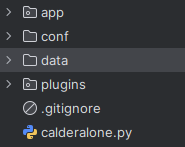
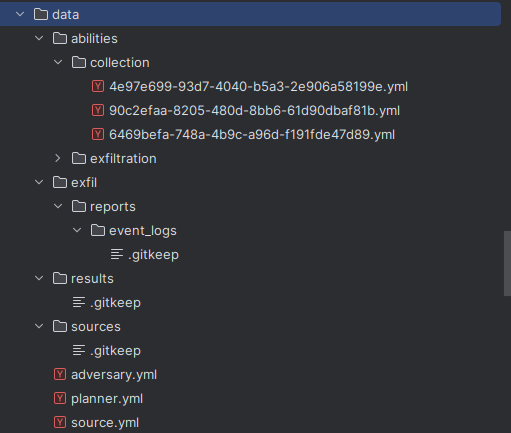

# Standalone Agent: Calder-alone

An agent that simulates the [Caldera](https://github.com/mitre/caldera) functionality in planning and execution 
test cases for an adversary plan in an isolated environment (no need to initiate C2 connections as Caldera)

# Installation

Using the Standalone plugin with Caldera to enable auto-generating standalone agent 

To run Caldera along with the Standalone plugin and generate a standalone agent:
1. Download Caldera as detailed in the [Installation Guide](https://github.com/mitre/Caldera)
2. Enable the Standalone plugin by adding `- standalone` to the list of enabled plugins in `conf/local.yml` or `conf/default.yml` (if running Caldera in insecure mode)
3. Start Caldera 
4. Using `standalone` plugin to choose adversary, planner and fact source before generating agent (in `.tar.gz` or `.zip` format)
5. Download agent

# Additional setup
When executing the agent, it must be confirmed that the folder tree is organized correctly. 

E.g.

Payloads are stored in the root of agent folder

Agent requires installation of `python3` and some dependencies. It can be installed by using the following:

- Linux: `sudo apt-get install python`
- Windows: https://www.python.org/downloads/

- Install dependencies:
`pip3 install rich pyyaml mutidict cryptography marshmallow marshmallow-enum`
